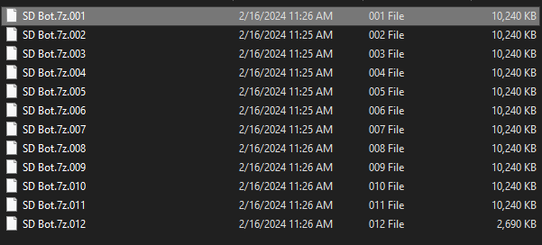
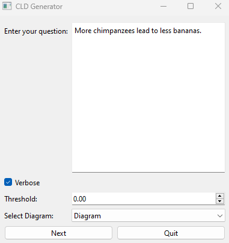

# From Text to Diagram: A System Dynamics Bot for Causal Loop Construction

This repository includes the desktop application for the software described in the paper: **From Text to Diagram: A System Dynamics Bot for Causal Loop Construction**

>**Abstract:** We introduce and test the System Dynamics Bot, a computer program leveraging a large language model to automate the creation of causal loop diagrams from textual data. To evaluate its performance, we ensembled two distinct databases. The first dataset includes 20 causal loop diagrams and associated texts sourced from system dynamics literature. The second dataset comprises responses from 30 participants to the Lake Urmia Vignette, along with causal loop diagrams coded by three system dynamics modelers. The bot uses textual data and successfully identifies approximately sixty percent of the links between variables and feedback loops in both datasets. This paper outlines our approach, provides examples, and presents evaluation results.
>We discuss encountered challenges and implemented solutions in developing the System Dynamics Bot. The Bot can facilitate extracting mental models from textual data and improve model building processes. Moreover, the two datasets can serve as a testbed for similar programs.

## Prerequisites
1. Any software that can extract .7z files (such as 7-zip, gzip, WinRar, WinZip, etc). If you do not have any software that can extract files, then you can download 7-zip from [here](https://www.7-zip.org/a/7z2401-x64.exe). 
2. The application was created using [pyinstaller](https://pypi.org/project/pyinstaller/) and [PySide6](https://pypi.org/project/PySide6/). Therefore, a user's device will see it as a potentially unwanted program (or PUP). Turn off your antivirus, or exclude the application from being scanned by the antivirus to avoid it being deleted from your device or quarantined. 
3. This is a Windows specific application. Future versions will have Linux and MacOS compatible applications as well. 
4. An OpenAI API key is required to use this application. A user can [create an account](https://platform.openai.com/login) with OpenAI, navigate to the [API key page](https://platform.openai.com/account/api-keys) and click on "Create new secret key", optionally naming the key. **Make sure to save this somewhere safe and do not share it with anyone.**

## Instructions for extracting SD Bot application
The application has been compressed into 12 parts and stored in the folder [SD Bot](./SD%20Bot/). To extract this application you will need to follow the following steps:

Step 1: Navigate to [SD Bot folder](./SD%20Bot/) and locate the file named [SD Bot.7z.001](SD%20Bot/SD%20Bot.7z.001).

Step 2: Right click on this file, and from the popup menu, select "7zip" (or any other software listed in Prerequisites #1) and then "Extract Here". 

After extraction, the "SD Bot.exe" file will appear in your current folder. 

## Instructions to exclude the application from antivirus
Before running "SD Bot.exe", the user has to make sure that it is not flagged as a PUP as explained in the Prerequisites section. To do that, the user either has to turn the antivirus off, or exclude it from their antivirus scans. If you do not have an antivirus installed, Windows Defender may show you a warning such as this:

Go to More Info, and click on Run Anyway:

### Turn off your antivirus
Step 1: **Look for the antivirus icon:** Typically, you can find the antivirus icon in the system tray (bottom right corner of your screen on Windows computers). It might look like a shield or another recognizable symbol.

Step 2: **Right-click on the antivirus icon:** This should bring up a menu with various options. Look for an option like "Disable," "Turn off," or "Pause protection." It may also be under a submenu like "Protection" or "Real-time scanning."

Step 3: **Select the appropriate option:** Click on the option that allows you to disable the antivirus protection.

Step 4: **Re-enable the antivirus:** Once running "SD Bot.exe" is done, repeat the process but select the option to enable or turn on protection.

### Exclude SD Bot.exe from your antivirus
To exclude a single .exe file from being scanned by your antivirus software, follow these general steps. Keep in mind that the exact process may vary depending on the antivirus program you're using:

Step 1: **Open your antivirus software:** This step is the same as the first step above.

Step 2: **Access the settings or preferences:** Once you've opened your antivirus software, look for an option that allows you to configure settings or preferences. This is typically found in a menu or toolbar within the antivirus program.

Step 3: **Navigate to the exclusions or exceptions settings:** Within the settings or preferences menu, look for an option related to exclusions, exceptions, or exclusions list. This is where you can specify files, folders, or applications that you want to exclude from scans.

Step 4: **Add SD Bot.exe file to the exclusion list:** In the exclusions or exceptions settings, there should be an option to add files or applications to the exclusion list. Click on this option, and then navigate to the location of the SD Bot.exe file. Select it and add it to the exclusion list. Ensure to save your changes within the antivirus settings.

## Instructions to run SD Bot

Step 1: Double click on "SD Bot.exe". A dialog box that looks like this should show up: 

    

Please provide your OpenAI API key in this dialog box and click on **Next**.

Step 2: When you click on Next, you should see the following dialog box:

    

This window enables the user to customize the various options that define the execution of the SD Bot. The user can enter the text that they want analyzed for causal relationships in the text editor. The various options are explained below:
| Options | Explanation | Recommended Value |
|----------|----------|----------|
| Verbose  | This option, when checked, lets the user view all the inner workings and reasonings of the SD Bot in real time, not just the final response.   | Checked   |
| Threshold   | This option is used to compare similarities between variables. It is recommended to use a high value (>0.8) to get meaningful results. A low value of the threshold may show all variables to be similar to each other.  | 0.85   |
| Select Diagram   | This option is used to choose whether the user wants just the causal relationships (No Diagram) or the causal loop diagram as well (Diagram). | Diagram   |

After choosing the appropriate options and providing your text, click on **Next**.

Step 3: The CLD Generator window should now be open as shown below:

    

Click on **Generate Relationships**. The analysis should start immediately. Wait for it to ask for your inputs in case similar variables get identified. For example in the following window, setting a threshold of 0.00 will ensure that all variables will be identified as similar variables. The user is asked to choose which groups of similar variables they would like to keep. To choose, follow the instructions outlined in the Outputs screen and provide your choice by typing in the Text Editor at the bottom and clicking on **Enter User Choices**. 

    

Once you provide your choice, the group(s) you choose will be kept and the remaining variables merged together into one variable, and the causal relationships updated accordingly. 

If you have selected Diagram option from Select Diagram, you will be prompted to save the diagram in a location of your choosing. After saving, the diagram will be displayed. For example:

    

**Once the final relationships/causal loop diagram is displayed, unfortunately there is no way of going back to the previous screen and trying out a different combination of inputs. Instead, the user has to close the application, and restart it by clicking on the "SD Bot.exe" once again. Please do not click the "Generate Relationships button again, as this may cause the program to crash. Subsequent versions will improve on this behavior.**